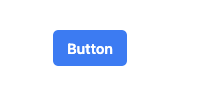
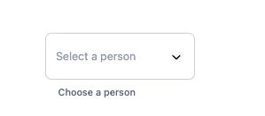
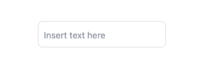

# mf-design-components

`mf-design-components` is a collection of reusable React components designed to streamline your development process. This package includes a variety of components styled with Tailwind CSS and optimized for modern React applications.

## Requirements

- **Node.js**: Version 18.x or higher. You can check your Node.js version with:
  ```bash
  node -v
  ```
- **Package Manager**: Either npm or Yarn. Ensure you have one of these installed:
  - **npm**: Comes with Node.js. Verify with:
    ```bash
    npm -v
    ```
  - **Yarn**: Install with:
    ```bash
    npm install -g yarn
    ```
    Verify with:
    ```bash
    yarn -v
    ```

## Installation

To install the `mf-design-components` library, you can use either npm or yarn:

```bash
npm install mf-design-components
```

or

```bash
yarn add mf-design-components
```

## Storybook

You can explore and test all components in the [Storybook documentation](https://eduardoleor.github.io/mf-design-components/).

## Next.js Project Using `mf-design-components`

For an example of how to use `mf-design-components` in a Next.js project, check out the [mf-frontend repository](https://github.com/Eduardoleor/mf-frontend).

## Components

### [Button](src/components/Button/README.md)

A customizable button component with various styles and sizes.



### [Dropdown](src/components/Dropdown/README.md)

A versatile dropdown component with support for sorting, searching, and custom icons.



### [Input](src/components/Input/README.md)

A customizable input with variants to support different types.



### [Text](src/components/Text/README.md)

A customizable text with based in `<p/>` tag.


## NPM Package

You can view the package details and download the latest version from [npm](https://www.npmjs.com/package/mf-design-components).

## How to Contribute a create Component

To create a new component in this library, follow these steps:

1. **Create a Directory**: Add a new directory for your component under `src/components/`.

2. **Component Files**: Include the following files in the component directory:

   - **`index.tsx`**: The main component file where you define your component's logic and JSX.
   - **`index.stories.tsx`**: Storybook stories for your component. This helps in visualizing and testing different states of the component.
   - **`styles.ts`**: Define your component's styles here.
   - **`Component.test.tsx`**: Write unit tests for your component to ensure it behaves as expected.
   - **`README.md`**: Documentation for your component, including usage instructions and examples.

### Component Structure

Here’s an example of what your Tooltip component structure might look like:

- **File Structure**:
  ```
  src/components/Tooltip
  ├── index.tsx
  ├── Tooltip.stories.tsx
  ├── styles.ts
  ├── Tooltip.test.tsx
  └── README.md
  ```

## Usage

Here's an example of how to use the `Dropdown` component:

```jsx
import React from 'react';
import { Dropdown } from 'mf-design-components';
import { UserIcon, BookmarkSlashIcon, ComputerDesktopIcon, DocumentCurrencyEuroIcon, ExclamationTriangleIcon } from '@heroicons/react/20/solid';

const Example = () => {
  const handleSelect = (value: string) => {
    console.log(`Selected value: ${value}`);
  };

  return (
    <Dropdown
      options={[
        { value: '1', label: 'Juan Perez', icon: <UserIcon className="w-4 h-4 text-gray-500" /> },
        { value: '2', label: 'Maria Gonzalez', icon: <BookmarkSlashIcon className="w-4 h-4 text-gray-500" /> },
        { value: '3', label: 'Carlos Martinez', icon: <ComputerDesktopIcon className="w-4 h-4 text-gray-500" /> },
        { value: '4', label: 'Ana Lopez', icon: <DocumentCurrencyEuroIcon className="w-4 h-4 text-gray-500" /> },
        { value: '5', label: 'Luis Hernandez', icon: <ExclamationTriangleIcon className="w-4 h-4 text-gray-500" /> },
      ]}
      placeholder="Select a person"
      label="Choose a person"
      isSortable={true}
      showIcon={true}
      searchable={true}
      onSelect={handleSelect}
    />
  );
};

export default Example;
```

## Development

To develop and test the components locally, you can use the following commands:

- **Start development server:**

  ```bash
  npm run dev
  ```

- **Build the library:**

  ```bash
  npm run build
  ```

- **Run Storybook:**

  ```bash
  npm run storybook
  ```

- **Build Storybook:**

  ```bash
  npm run build-storybook
  ```

- **Run tests:**

  ```bash
  npm test
  ```

## Linting and Formatting

To ensure code quality, we use ESLint and Prettier. To lint and format your code, use the following commands:

- **Lint code:**

  ```bash
  npm run lint
  ```

### Deployment Flowchart

```plaintext
+------------------------+
| Start                  |
+------------------------+
           |
           v
+------------------------+
| Code Check Out         |
+------------------------+
           |
           v
+------------------------+
| Set up Node.js         |
+------------------------+
           |
           v
+------------------------+
| Install Dependencies   |
+------------------------+
           |
           v
+------------------------+
| Run Tests              |
+------------------------+
           |
           v
+------------------------+
| Build Project          |
+------------------------+
           |
           v
+------------------------+
| Build Storybook        |
+------------------------+
           |
           v
+------------------------+
| Deploy to NPM          |
+------------------------+
           |
           v
+------------------------+
| Deploy to GitHub Pages |
+------------------------+
           |
           v
+------------------------+
| End                    |
+------------------------+
```

### Explanation

1. **Start**: Initiate the CI process when code is pushed or a pull request is made.
2. **Code Check Out**: The CI system checks out the code from the repository.
3. **Set up Node.js**: Configure the Node.js environment.
4. **Install Dependencies**: Install the necessary dependencies for the project.
5. **Run Tests**: Execute the test suite to ensure the code is working as expected.
6. **Build Project**: Compile and build the project.
7. **Build Storybook**: Generate the Storybook build for documentation.
8. **Deploy to NPM**: Publish the package to NPM if the build and tests are successful.
9. **Deploy to GitHub Pages**: Deploy Storybook to GitHub Pages if the build and tests are successful.
10. **End**: Complete the deployment process.

This flowchart represents the CI/CD process as a series of steps, making it easier to understand the order and dependencies involved in deploying the project.

## Contributing

Contributions are welcome! Please open an issue or submit a pull request with any changes or improvements.

## License

This project is licensed under the MIT License. See the [LICENSE](LICENSE) file for details.

## Acknowledgments

This project uses several open-source libraries:

- [@heroicons/react](https://www.npmjs.com/package/@heroicons/react)
- [class-variance-authority](https://www.npmjs.com/package/class-variance-authority)
- [clsx](https://www.npmjs.com/package/clsx)
- [tailwind-merge](https://www.npmjs.com/package/tailwind-merge)

This structure will help users navigate to the specific README files for each component to get more detailed information.
